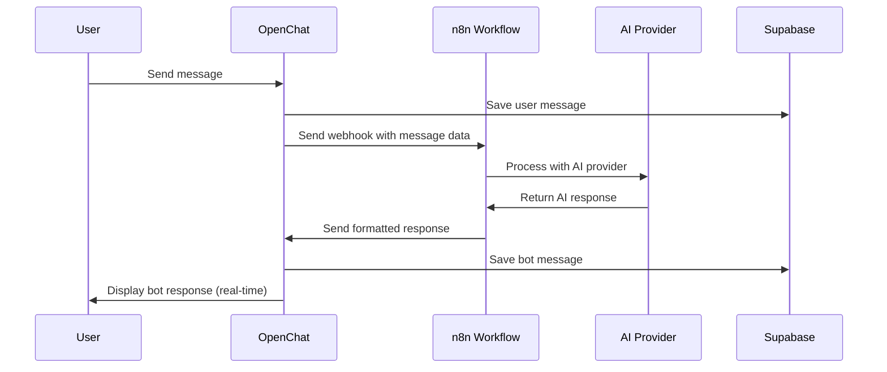

# AI Bot Integration Guide

OpenChat supports AI chatbot integration through n8n workflows, allowing you to add intelligent responses to your chat platform.

## 🤖 Overview

The AI bot integration allows:
- **Real-time responses** to user messages
- **Context-aware conversations** with message history
- **Room-scoped interactions** - Bot works in public chat, private rooms, and groups
- **Customizable bot personality** through n8n workflows
- **Rate limiting** to prevent spam
- **Secure webhook communication**

## 🛠️ Setup Requirements

### 1. n8n Instance
You need either:
- **Self-hosted n8n** (recommended for production)
- **n8n.cloud** account (easier setup)

### 2. OpenAI API Key (or other LLM provider)
- Sign up at [OpenAI Platform](https://platform.openai.com/)
- Generate an API key
- Store it securely in n8n

## 📋 Step-by-Step Setup

### Step 1: Set Up n8n Workflow

1. **Create New Workflow**
   - Log into your n8n instance
   - Create a new workflow
   - Name it "OpenChat AI Bot"

2. **Add Webhook Node**
   - Add a "Webhook" node as the trigger
   - Set HTTP Method to "POST"
   - Set Path to "openchat-bot" (or custom path)
   - Authentication: None (we'll secure it with tokens)

3. **Add Function Node for Processing**
   ```javascript
   // Process incoming message data
   const messageData = $json;
   
   // Extract relevant information
   const userMessage = messageData.content;
   const userName = messageData.sender_name;
   const messageHistory = messageData.recent_messages || [];
   
   // Prepare context for AI
   const context = messageHistory
     .slice(-5) // Last 5 messages for context
     .map(msg => `${msg.sender_name}: ${msg.content}`)
     .join('\n');
   
   const prompt = `You are a helpful AI assistant in a chat room. 
   
   Recent conversation:
   ${context}
   
   Current message from ${userName}: ${userMessage}
   
   Respond in a friendly, helpful manner. Keep responses concise (under 200 characters).`;
   
   return [{
     json: {
       prompt: prompt,
       original_message: messageData
     }
   }];
   ```

4. **Add OpenAI Node**
   - Add "OpenAI" node (or your preferred LLM provider)
   - Configure with your API key
   - Set model to "gpt-3.5-turbo" or "gpt-4"
   - Connect the prompt from previous node

5. **Add Response Function**
   ```javascript
   // Format response for OpenChat
   const aiResponse = $json.choices[0].message.content;
   const originalMessage = $('Function').first().$json.original_message;
   
   return [{
     json: {
       content: aiResponse,
       sender_name: "AI Assistant",
       is_bot_message: true,
       reply_to_user: originalMessage.sender_name,
       webhook_token: "your-secret-token" // For verification
     }
   }];
   ```

6. **Add HTTP Request Node**
   - Method: POST
   - URL: Your OpenChat webhook URL (we'll configure this next)
   - Headers: `Content-Type: application/json`
   - Body: JSON data from previous node

### Step 2: Configure OpenChat

1. **Set Environment Variable**
   ```env
   VITE_N8N_WEBHOOK_URL=https://your-n8n-instance.com/webhook/openchat-bot
   ```

2. **Configure Webhook Token (Optional but Recommended)**
   ```env
   VITE_BOT_WEBHOOK_TOKEN=your-secret-token
   ```

### Step 3: Test Integration

1. **Test n8n Workflow**
   - Use the "Test" button in n8n
   - Send a sample message payload
   - Verify the workflow executes successfully

2. **Test in OpenChat**
   - Send a message in your chat
   - Look for the bot response within a few seconds
   - Check browser console for any errors

## 📊 Message Flow



## 🔧 Advanced Configuration

### Custom Bot Personality

Modify the prompt in your n8n Function node:

```javascript
const prompt = `You are a helpful coding assistant in a developer chat room.

Personality traits:
- Friendly and encouraging
- Focus on practical solutions
- Use code examples when helpful
- Keep responses under 200 characters
- Use occasional emoji for friendliness

Recent conversation:
${context}

Current message from ${userName}: ${userMessage}

Provide a helpful response:`;
```

### Rate Limiting

Add rate limiting to your n8n workflow:

```javascript
// Rate limiting logic
const userId = $json.sender_id;
const now = Date.now();
const rateLimitKey = `ratelimit_${userId}`;

// Check if user has exceeded rate limit (e.g., 5 messages per minute)
const lastRequests = $workflow.getLastExecutionData()?.data || [];
const recentRequests = lastRequests.filter(req => 
  req.userId === userId && 
  (now - req.timestamp) < 60000 // 1 minute
);

if (recentRequests.length >= 5) {
  // Skip processing - rate limited
  return [];
}

// Continue with normal processing...
```

### Context Management

Enhanced context processing:

```javascript
// Enhanced context processing
const messageHistory = messageData.recent_messages || [];
const relevantContext = messageHistory
  .filter(msg => !msg.is_bot_message) // Exclude bot messages
  .slice(-10) // Last 10 user messages
  .map(msg => `${msg.sender_name}: ${msg.content}`)
  .join('\n');

// Add topic detection
const currentTopic = detectTopic(userMessage);
const contextualPrompt = buildContextualPrompt(currentTopic, relevantContext, userMessage);
```

## 🔒 Security Considerations

### Webhook Security

1. **Use HTTPS Only**
   - Ensure your n8n instance uses HTTPS
   - Verify SSL certificates

2. **Implement Token Verification**
   ```javascript
   // In your n8n workflow
   const expectedToken = "your-secret-token";
   const receivedToken = $json.webhook_token;
   
   if (receivedToken !== expectedToken) {
     return [{
       json: { error: "Unauthorized" }
     }];
   }
   ```

3. **Input Validation**
   ```javascript
   // Validate incoming data
   const content = $json.content;
   if (!content || typeof content !== 'string' || content.length > 1000) {
     return [{
       json: { error: "Invalid message content" }
     }];
   }
   ```

### API Key Protection

- Store API keys in n8n credentials
- Use environment variables
- Never expose keys in workflow code
- Rotate keys regularly

## 🚨 Troubleshooting

### Common Issues

1. **Bot Not Responding**
   - Check n8n workflow execution logs
   - Verify webhook URL is correct
   - Test webhook manually with curl:
     ```bash
     curl -X POST https://your-n8n-instance.com/webhook/openchat-bot \
       -H "Content-Type: application/json" \
       -d '{"content":"test message","sender_name":"Test User"}'
     ```

2. **Slow Response Times**
   - Check AI provider response times
   - Optimize your n8n workflow
   - Consider using faster AI models

3. **Rate Limit Errors**
   - Check AI provider rate limits
   - Implement workflow-level rate limiting
   - Consider upgrading your AI provider plan

4. **Invalid Responses**
   - Verify response format matches expected structure
   - Check n8n function node outputs
   - Review AI provider response parsing

### Debug Mode

Enable debug logging in your n8n workflow:

```javascript
// Add debug logging
console.log("Received message:", JSON.stringify($json, null, 2));
console.log("Generated prompt:", prompt);
console.log("AI response:", aiResponse);

// Return debug info (remove in production)
return [{
  json: {
    content: aiResponse,
    debug: {
      prompt: prompt,
      originalMessage: originalMessage,
      timestamp: new Date().toISOString()
    }
  }
}];
```

## 📈 Monitoring

### Performance Metrics

Track these metrics in your n8n workflow:

- Response time from webhook to bot reply
- AI provider API response times
- Error rates and types
- User engagement with bot responses

### Analytics

```javascript
// Add analytics tracking
const analytics = {
  messageLength: userMessage.length,
  responseTime: Date.now() - startTime,
  aiModel: "gpt-3.5-turbo",
  success: true
};

// Send to analytics service (optional)
```

## 🎯 Best Practices

1. **Keep Responses Concise**
   - Limit responses to 200-300 characters
   - Use bullet points for lists
   - Focus on actionable advice

2. **Maintain Context**
   - Include recent conversation history
   - Remember user preferences within session
   - Acknowledge previous interactions

3. **Error Handling**
   - Gracefully handle AI provider errors
   - Provide fallback responses
   - Log errors for debugging

4. **User Experience**
   - Make it clear when the bot is responding
   - Allow users to disable bot interactions
   - Respect rate limits and user preferences

## 📚 Example Use Cases

### Code Help Bot
```javascript
const prompt = `You are a coding assistant. Help users with programming questions.

Current question: ${userMessage}

Provide a concise answer with code examples if relevant.`;
```

### Moderation Bot
```javascript
const prompt = `Review this message for inappropriate content: "${userMessage}"

Respond with either "APPROVED" or provide a brief moderation note.`;
```

### Fun Facts Bot
```javascript
const prompt = `Share an interesting fact related to: ${userMessage}

Keep it under 150 characters and make it engaging!`;
```

## 🏠 Bot in Rooms and Groups

### Room Context

As of the latest update, OpenChat supports bots in **private rooms** and **group chats**!

**Key Points:**
- Bot messages are scoped to the specific room
- Each room has its own bot conversation context
- `channel_id` is passed with every bot request
- Bot responses must include the same `channel_id`

### Updated Workflow for Room Support

Ensure your n8n webhook receives and returns the `channel_id`:

```javascript
// In your processing function
const messageData = $json;
const channelId = messageData.channel_id || null; // null = public chat

// Store channel_id for response
return [{
  json: {
    prompt: generatedPrompt,
    channel_id: channelId, // Pass through to response
    original_message: messageData
  }
}];
```

**In your response function:**
```javascript
// Format response with channel_id
const channelId = $('Function').first().$json.channel_id;

return [{
  json: {
    content: aiResponse,
    sender_name: "AI Assistant",
    is_bot_message: true,
    channel_id: channelId, // CRITICAL: Include the channel_id!
    webhook_token: "your-secret-token"
  }
}];
```

### Room-Aware Bot Personality

You can customize bot behavior based on room type:

```javascript
// Detect room type based on channel_id
const isPublicChat = !messageData.channel_id;
const isPrivateRoom = messageData.channel_id && messageData.channel_id.startsWith('private');
const isGroupRoom = messageData.channel_id && messageData.channel_id.startsWith('group');

let personality = "helpful assistant";

if (isPublicChat) {
  personality = "casual and welcoming";
} else if (isPrivateRoom) {
  personality = "professional and focused";
} else if (isGroupRoom) {
  personality = "collaborative team assistant";
}

const prompt = `You are a ${personality} in an OpenChat room.

${context}

Current message: ${userMessage}

Respond appropriately for this context.`;
```

### Testing Room Integration

1. **Test in Public Chat:**
   ```
   @bot hello
   ```
   Expected: Bot responds in public chat

2. **Test in Private Room:**
   - Create a private room
   - Send `@bot test private`
   - Expected: Bot responds only in that room

3. **Test in Group:**
   - Create a group with multiple members
   - Send `@bot test group`
   - Expected: All group members see the bot response

---

Your AI bot should now be successfully integrated with OpenChat in all contexts! 🤖✨